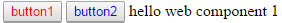

The most simple form of web component only supported by chrome as we do not include any polyfill. 

##Description

The idea was to test the very basic ways to interact with a web component by passing
- static information
- callback functions

To do so I created a web component composed of two buttons and a text zone (see below). From the host html page I can then pass the following information.
 
```html
<body>
    <mo-wc-test1 id='wc1'></mo-wc-test1>
    
    <script type='text/javascript'>
    	var wc = document.querySelector('#wc1');
    	wc.render(
    		{
    			name : 'hello web component 1',
    			onButton1Clicked : function(){
    				alert('wc1 button 1 clicked');
    			}
    		});
    	//...
    </script>
    <!-- ... -->
</body>
```
Will render like this



##Run the example

Simply open the `index.html` page in Chrome. To do so, you will need to run chrome with the following options (on windows)

`chrome.exe --disable-web-security --user-data-dir=C:\WHATEVER_YOU_WANT`
